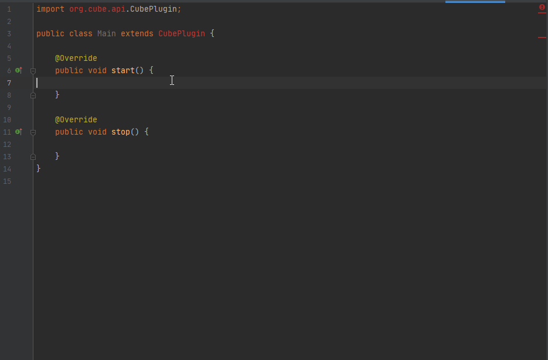
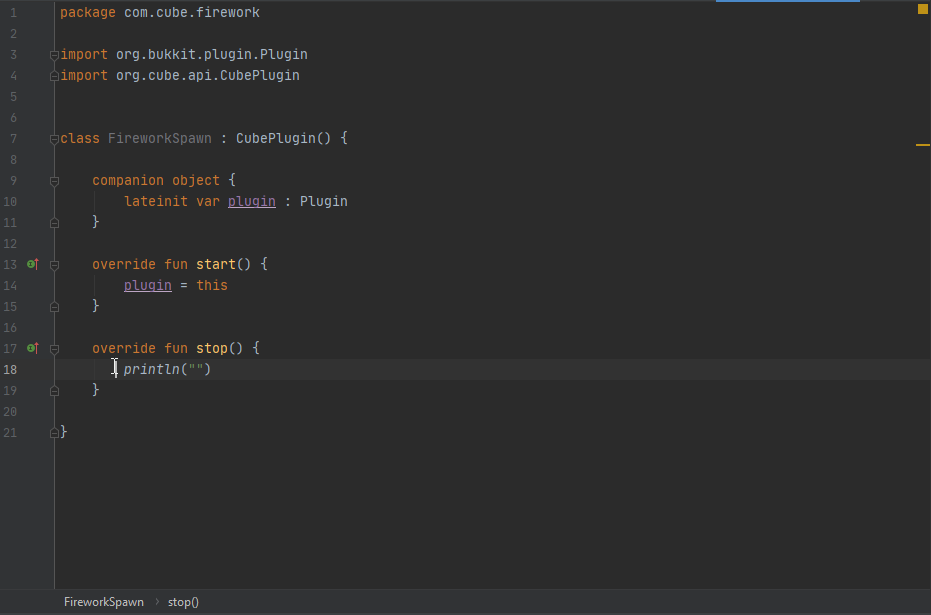

# Setting Up

In your Main class Extend **CubePlugin**

And use the methods 





```text

@Override
public void start() {

}
```

```text
@Override
public void stop() {

}
```





```text
override fun start() {
```

```text
override fun stop() {
```



Inside this is where all your main code for your plugin will go that you wish to startup with your main class now should be looking like this












